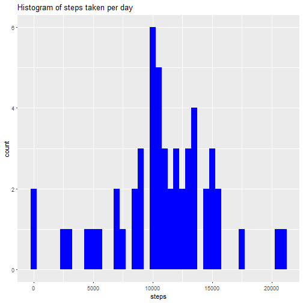
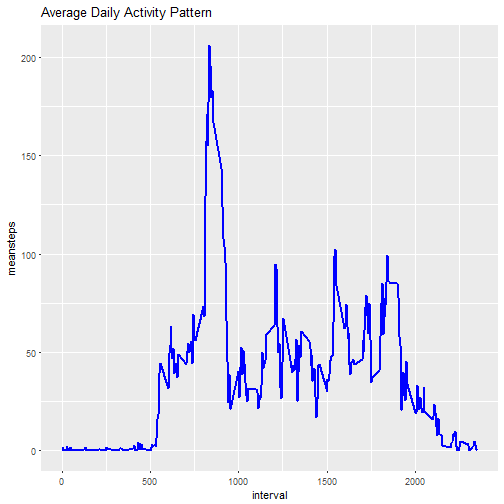
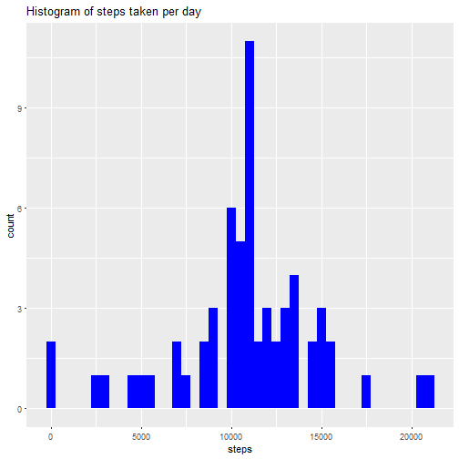
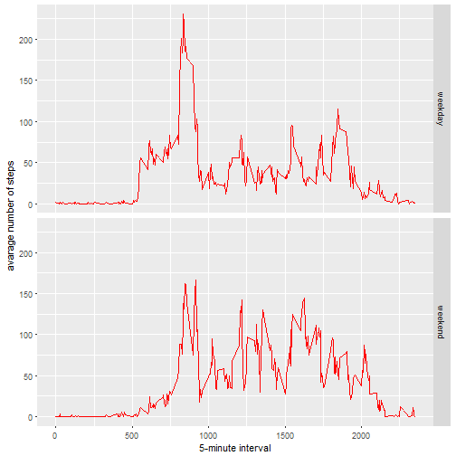

ReProducible Research-Assessment 1
================================================

Setting the Work Directory where data is saved


```r
setwd("C:/Users/Navonil/Desktop/r/coursera/ReproducableReserch")
```

1.Let's Load the data


```r
rdata<-read.csv('activity.csv',header = TRUE,sep=",",colClasses = c("numeric","character","numeric"))
```

2.Data PreProcessing


```r
rdata$date<-as.Date(rdata$date,format="%Y-%m-%d")
```

##What is mean total number of steps taken per day?

1.Let's calculate total number of steps per day.


```r
Steps_per_day<-aggregate(steps~date,rdata,sum)
colnames(Steps_per_day)<-c("date","steps")
```

2.Now lets plot the histogram


```r
library(ggplot2)
ggplot(Steps_per_day,aes(x=steps))+
  geom_histogram(fill="blue",binwidth=500)+
  labs(title="Histogram of steps taken per day",xlab="No.of steps per day",ylab="Count per day")
```



3.Now lets calculate the mean & median of steps per day


```r
stepsperday_mean<-mean(Steps_per_day$steps,na.rm=TRUE)
stepsperday_median<-median(Steps_per_day$steps,na.rm=TRUE)
```
mean 1.0766189 &times; 10<sup>4</sup>
median 1.0765 &times; 10<sup>4</sup>

##What is the average daily activity pattern?

Let's create a dataset for steps by interval of 5 minutes

```r
steps_per_interval<-aggregate(x=list(meansteps=rdata$steps),by=list(interval=rdata$interval),mean,na.rm=TRUE)
```

1.Now lets create the Time series plot

```r
ggplot(steps_per_interval,aes(x=interval,y=meansteps))+
  geom_line(color="blue",size=1)+
  labs(title="Average Daily Activity Pattern",xlab="Interval",ylab="No of steps")
```



2.Now lets see which interval contains maximum number of steps


```r
max_interval<-steps_per_interval[which.max(steps_per_interval$meansteps),]
```
maximun steps in interval 835, 206.1698113

##Imputing missing values

1.Lets calculate the length of missing values in steps as only steps are holding missing values. 


```r
missing_values<-sum(is.na(rdata$steps))
```
numer of missing value 2304


2&3.Strategy for missing value imputation & creating dataset with imputed values

We will be using the mean steps per interval from steps_per_interval data for each missing steps for same interval


```r
library(sqldf)
##Creating a dataset with mising data only
missingdata<-rdata[which(is.na(rdata$steps)),]
##replacing missing data with mean values from steps_per_interval data
imputed_data<-sqldf("SELECT b.[meansteps] AS steps,a.[date] AS date,a.[interval] AS interval
                    FROM missingdata AS a LEFT JOIN steps_per_interval AS b
                    ON a.[interval]=b.[interval]")
##binding datasets to complete the original data
rdata_imputed<-rbind(rdata[which(!is.na(rdata$steps)),],imputed_data)
```


4.Let's plot the histogram again & calculate the mean & median


```r
Steps_per_day_imputed<-aggregate(steps~date,rdata_imputed,sum)
colnames(Steps_per_day_imputed)<-c("date","steps")
```


```r
ggplot(Steps_per_day_imputed,aes(x=steps))+
  geom_histogram(fill="blue",binwidth=500)+
  labs(title="Histogram of steps taken per day",xlab="No.of steps per day",ylab="Count per day")
```




```r
imp_stepsperday_mean<-mean(Steps_per_day_imputed$steps,na.rm=TRUE)
imp_stepsperday_median<-median(Steps_per_day_imputed$steps,na.rm=TRUE)
```
imputed mean 1.0766189 &times; 10<sup>4</sup>
imputed median 1.0766189 &times; 10<sup>4</sup>


So after missing value imputation there is no change in mean value whereas median value changed from 10765 to 10766.19(which is same as mean value)

I guess there is not much impact of imputing missing data on the estimates of the total daily number of steps!!!


##Are there differences in activity patterns between weekdays and weekends?

1.Lets create a factor variable Weekdays with two levels weekday & weekend


```r
rdata_imputed$Weekdays<- ifelse(as.POSIXlt(rdata_imputed$date)$wday %in% c(0,6), 'weekend', 'weekday')
```

2.Let's make a panel polt including time series


```r
averaged_rdata_imputed <- aggregate(steps ~ interval + Weekdays, data=rdata_imputed, mean)
ggplot(averaged_rdata_imputed, aes(interval, steps)) + 
    geom_line(color="red") + 
    facet_grid(Weekdays ~ .) +
    xlab("5-minute interval") + 
    ylab("avarage number of steps")
```



